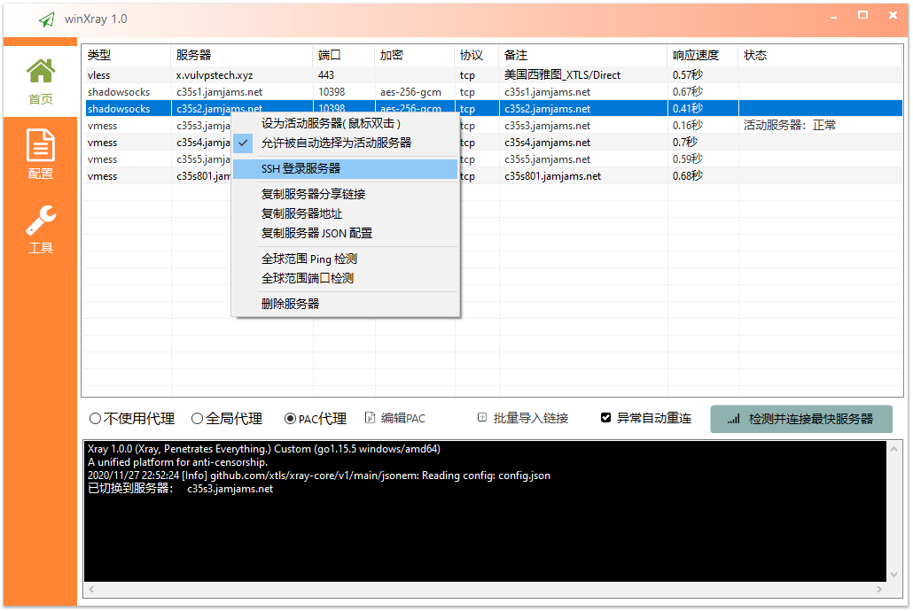
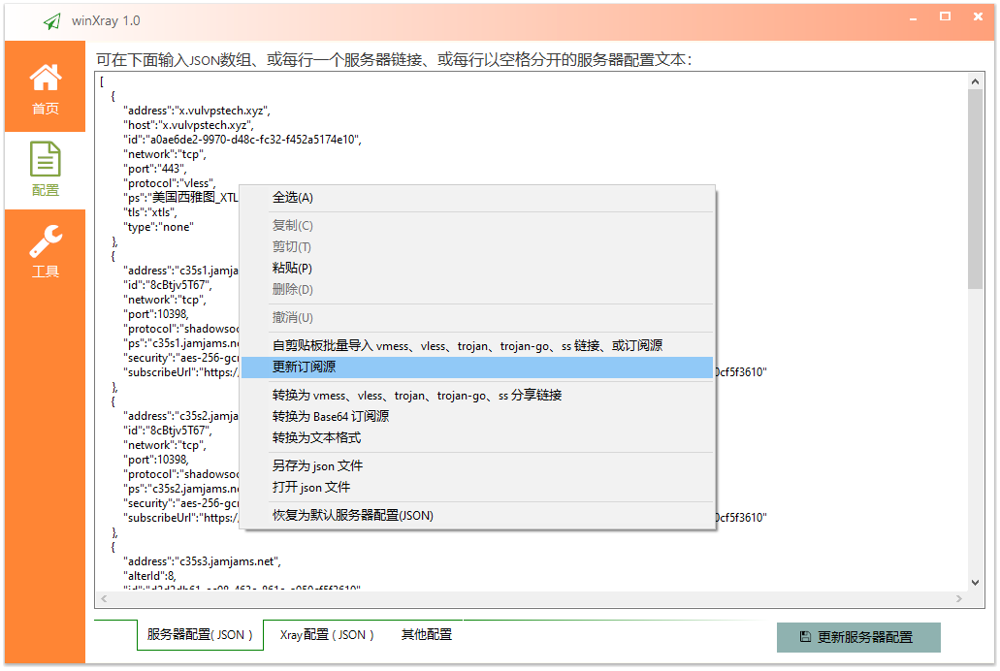
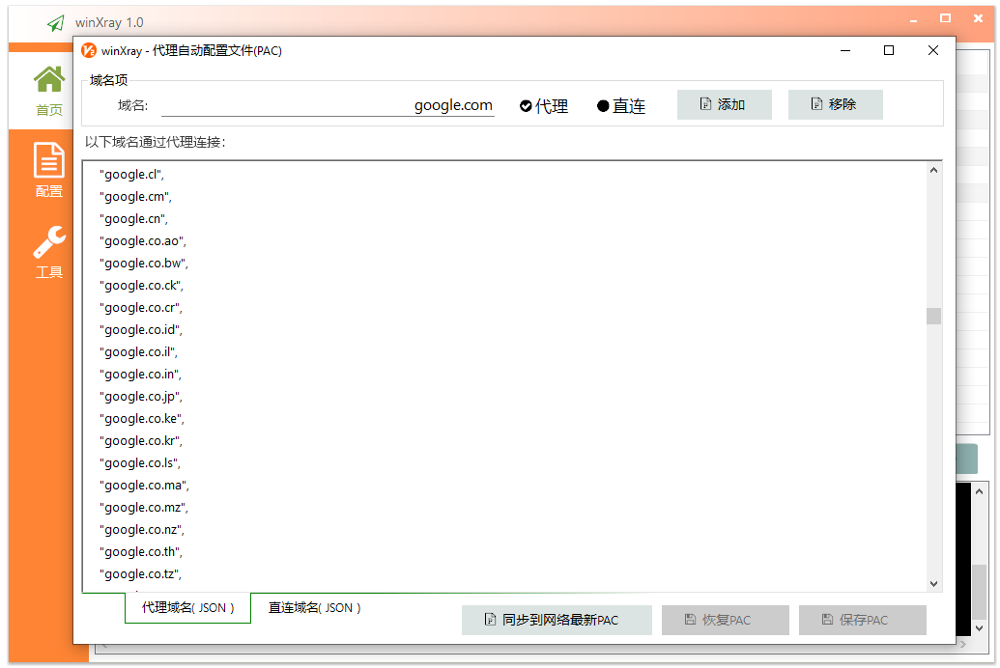

# winXray 
本软件源码已贡献到公共领域并放弃版权，源码可使用 [aardio（开发环境仅6.5MB）](http://www.aardio.com) 编译生成单文件绿色EXE( 不需要.Net等任何外部运行库 ），**[点这里下载](https://raw.githubusercontent.com/vuvptch/winXray/master/release/winXray.7z)** 解压即可直接使用( 包含 Xray-core 仅  **[5.0MB](https://raw.githubusercontent.com/vuvptch/winXray/master/release/winXray.7z)** ）。

winXray 是一个简洁稳定的 [xRay/V2Ray(vmess/vless/xtls)、Shadowsocks、Trojan](https://github.com/XTLS/Xray-core) 通用客户端（Windows系统），可自动检测并连接访问速度最快的代理服务器。服务器连接异常时可以自动更换代理服务器 - 再也不用担心服务器抽风了。winXray 也提供一键安装 XRay(V2Ray、Shadowsocks、Trojan) 服务器工具。

  
最新公益服务器列表
  <pre>
vless://bf4a6c2b-db1b-57de-f45a-364aa254d1f7@x.vulvpstech.xyz:443/?host=x.vulvpstech.xyz&tls=xtls#%E7%BE%8E%E5%9B%BD%E8%A5%BF%E9%9B%85%E5%9B%BE_XTLS%2FDirect
ss://YWVzLTI1Ni1nY206OGNCdGp2NVQ2N0BjMzVzMS5qYW1qYW1zLm5ldDoxMDM5OA==#c35s1.jamjams.net:10398
ss://YWVzLTI1Ni1nY206OGNCdGp2NVQ2N0BjMzVzMi5qYW1qYW1zLm5ldDoxMDM5OA==#c35s2.jamjams.net:10398
vmess://eyJhZGQiOiJjMzVzMy5qYW1qYW1zLm5ldCIsImFpZCI6OCwiaWQiOiJkMmQyZGI2MS1lYzk4LTQ2M2UtODYxZS1hOTUwY2Y1ZjM2MTAiLCJuZXQiOiJ0Y3AiLCJwb3J0IjoiMTAzOTgiLCJwcyI6ImMzNXMzLmphbWphbXMubmV0IiwidGxzIjoibm9uZSIsInR5cGUiOiJub25lIiwidiI6Mn0=
vmess://eyJhZGQiOiJjMzVzNC5qYW1qYW1zLm5ldCIsImFpZCI6OCwiaWQiOiJkMmQyZGI2MS1lYzk4LTQ2M2UtODYxZS1hOTUwY2Y1ZjM2MTAiLCJuZXQiOiJ0Y3AiLCJwb3J0IjoiMTAzOTgiLCJwcyI6ImMzNXM0LmphbWphbXMubmV0IiwidGxzIjoibm9uZSIsInR5cGUiOiJub25lIiwidiI6Mn0=
vmess://eyJhZGQiOiJjMzVzNS5qYW1qYW1zLm5ldCIsImFpZCI6OCwiaWQiOiJkMmQyZGI2MS1lYzk4LTQ2M2UtODYxZS1hOTUwY2Y1ZjM2MTAiLCJuZXQiOiJ0Y3AiLCJwb3J0IjoiMTAzOTgiLCJwcyI6ImMzNXM1LmphbWphbXMubmV0IiwidGxzIjoibm9uZSIsInR5cGUiOiJub25lIiwidiI6Mn0=
vmess://eyJhZGQiOiJjMzVzODAxLmphbWphbXMubmV0IiwiYWlkIjo4LCJpZCI6ImQyZDJkYjYxLWVjOTgtNDYzZS04NjFlLWE5NTBjZjVmMzYxMCIsIm5ldCI6InRjcCIsInBvcnQiOiIxMDM5OCIsInBzIjoiYzM1czgwMS5qYW1qYW1zLm5ldCIsInRscyI6Im5vbmUiLCJ0eXBlIjoibm9uZSIsInYiOjJ9
</pre>
    

之前我用过很多代理客户端，经常用一会就挂掉了，有些测试很久才找到下一个可用的服务器，有时怎么切换都不行，一定要把整个软件退出重启才能恢复。而且在WIN10上都有相同的BUG:PAC代理用一段时间就会卡死( winXray已经通过自行实现PAC服务器解决了这个问题 )，其实这些软件里提供的很多功能我并不需要，我只想愉快地用下 google 找点技术资料提升工作效率。但是在网上找了很久都没找到适合的软件，于是决定自己动手写一个，还好用 aardio 写软件的速度很快 - 大概用了几个小时就完成了 winXray 的主要代码，改进了几个版本以后就很稳定了，**我自己用了 winXray  几个月再也没有遇到 google 抽风访问不了的问题**。    

winXray支持批量导入 vmess、ss、trojan …… 等格式的分享链接，  
也可以导入订阅链接，以及 base 64、json、文本表格 …… 等不同格式的服务器配置都可以自动识别并导入 winXray。

可选在 ["/xray-core/winXray-default-servers.json"](./xray-core/winXray-default-servers.json) 文件中添加默认服务器配置（生成EXE后默认配置自动嵌入到EXE文件，可选删除该文件,也可以继续使用该文件覆盖EXE自带的默认服务器列表）。

软件首次运行时会在当前目录查找 "./xray-core/xray.exe"   
发行文件仅需要 "./winXray.exe"，可选带上 "./xray-core/" 目录（ 如果没有找到会自动到v2ray官网下载，不过没有代理服务器下载有时候非常慢 )。
